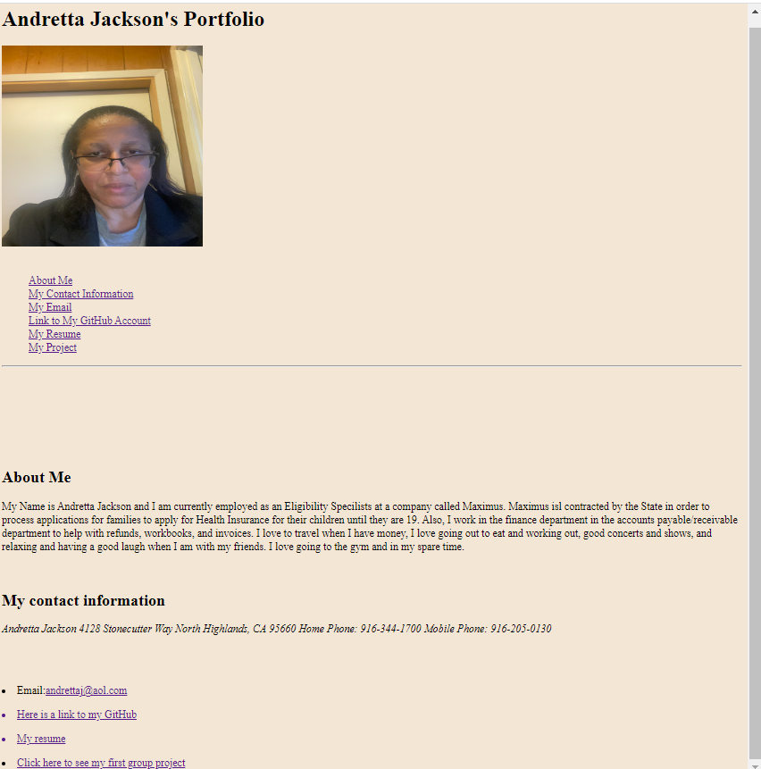

# andrettajsportfolio
##A portfolio to showcase my skills and talent

This is my professional portfolio that describes information about me.

My motivation for this application was to put skills in a location where they can easily be accessed quickly and for possible future employers to review them.

This application is very benefical and easily accessable where I am where I can quickly enter and update my skills.  I can be on break my work and enter this information on my I phone, a tablet, or another computer, where I do not have to wait until I get home to update my skills.

What makes my project stand out, is that I am always learning a new skill and it can show future employers the work I have done and they can make a quick decision to determine based on my portfolio if I am a possible fit for an interview or not waste any time and move onto the next candidate.  It makes the process alot faster.

Here is my deployed github web address: https://andrettaj.github.io/andrettajsportfolio/.

